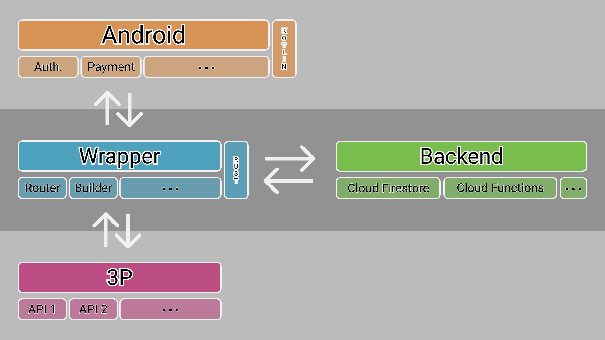

[](https://img.shields.io/badge/version-v1.0.0-blue.svg)
[](https://img.shields.io/badge/language-Kotlin-orange.svg)
[](https://img.shields.io/badge/platform-Android-lightgrey.svg)
[](./LICENSE)

# Content

[1 - Description](#description)

[2 - IDE](#ide)

[3 - Objective](#objective)

[4 - Composition](#composition)

[5 - Run](#run)

[6 - Requirements](#requirements)

[7 - Usage](#usage)

[8 - Singletons](#singletons)

[9 - References](#references)

[10 - Contact](#contact)

[11 - Forthcoming Work](#forthcoming-work)

[12 - Buy me a coffee](#buy-me-a-coffee-)

# Description

-   Android payments library designed with Jetpack. Android Architecture SDK.

# IDE

- Android Studio 3.5 Beta 5
- Build #AI-191.7479.19.35.5675373, built on June 20, 2019
- JRE: 1.8.0_202-release-1483-b49-5587405 x86_64
- JVM: OpenJDK 64-Bit Server VM by JetBrains s.r.o
- macOS 10.14.5

# Objective

  - Simplify integration of in-app purchases and google payments.

# Overview

 - This library allows direct calls to google APIs, but mostly it will allow to interactions through a middleware.



# Composition

  - SDK is total native.

# Run

  -   Clone this repository and open build.gradle with Android Studio

# Requirements

  -   minSdkVersion 25
  -   targetSdkVersion 28

# Usage

### 1 - Run start command

```
Payments.start(context);
```

### 2 - Let the fun begin ;) that simple.

#   References:

- N/A

#   Contact:

- roliveira.victor@gmail.com

#   Forthcoming Work:

- Allow custom API calls

#   Buy me a coffee ;)

[](https://www.paypal.com/cgi-bin/webscr?cmd=_donations&business=5VY87PA2ETA6A&item_name=Buy+me+a+coffe+%3B%29&currency_code=USD&source=url)


